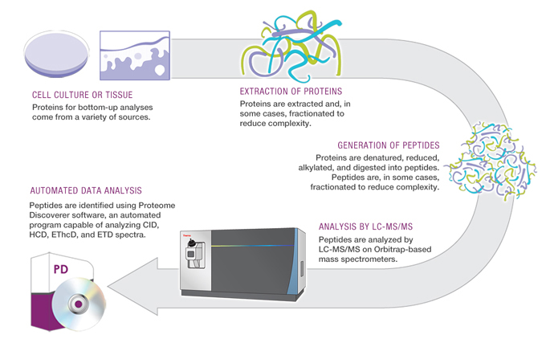

Proteomics is the study of the entire set of proteins that exist in a system (a population, an organism, an organ, a cell, etc.). Identifying and quantifying all these proteins is useful in genetic research, clinical diagnosis, biomarker discovery, population analysis, and countless other fields. In order to study the proteome, we rely heavily on analytical chemistry: specifically separations coupled with mass spectrometry.

The [general workflow](https://en.wikipedia.org/wiki/Bottom-up_proteomics) for a proteomics experiment involves digesting protein into smaller molecules (peptides), separating these peptides using [liquid chromatography](https://en.wikipedia.org/wiki/High-performance_liquid_chromatography) or [capillary electrophoresis](https://chem.libretexts.org/Bookshelves/Analytical_Chemistry/Supplemental_Modules_(Analytical_Chemistry)/Instrumental_Analysis/Capillary_Electrophoresis), and injecting them into a series of [mass spectrometers](https://en.wikipedia.org/wiki/Mass_spectrometry) which can measure the mass/charge ratio of intact and fragmented peptides. From this information, computers can match individual peptides to proteins, and based on signal intensity, the proteins can be quantified.  

  

As we know, proteins are polymers of individual amino acids, and it is this amino acid sequence (primary structure) that ultimately leads to higher orders of structure and function. Peptides are smaller polymers of amino acids (generally 4-50 residues in length) which (in this context) originate from digested protein.  

{width=75%}  

In proteomics, peptides are the analyte of interest, and so we want to know several of the chemical attributes that they possess: mass, charge, and mass/charge ratio. This last attribute is especially important because it is the basis of identification in mass spectrometry, and the basis of separation in capillary electrophoresis. Luckily, both mass and charge of a peptide can be thought of as the summation of the individual masses and charges of the amino acids that make up the peptide. Because there are [20 common amino acids](https://www.sigmaaldrich.com/life-science/metabolomics/learning-center/amino-acid-reference-chart.html), calculating and adding together their masses or charges becomes a manageable task for a computer to do quickly.  

[There](https://www.peptidesynthetics.co.uk/tools/) [are](https://web.expasy.org/peptide_mass/) [many](http://rna.rega.kuleuven.be/masspec/pepcalc.htm) [online](http://db.systemsbiology.net:8080/proteomicsToolkit/FragIonServlet.html) [tools](http://www.colby.edu/chemistry/NMR/scripts/peptide.html) that can do this type of calculation. While useful, these are not always ideal from an educational or research standpoint for several reasons. First, they generally work as 'black boxes' where the user puts in a peptide, and numbers are returned. It isn't clear to the user how these values were calculated, and therefore the chemistry behind these calculations isn't fully explored. Second, they can only handle one peptide at a time, or in some cases, one specific protein at a time. In my routine proteomic analysis, I will often have lists of thousands of peptides, and individually using these tools to calculate all their charges becomes impractical. In contrast, using R to perform these calculations will allow you to better understand how you've arrived at the final answers, and it will allow you to customize the script to answer very specific and important questions. Let's get started!