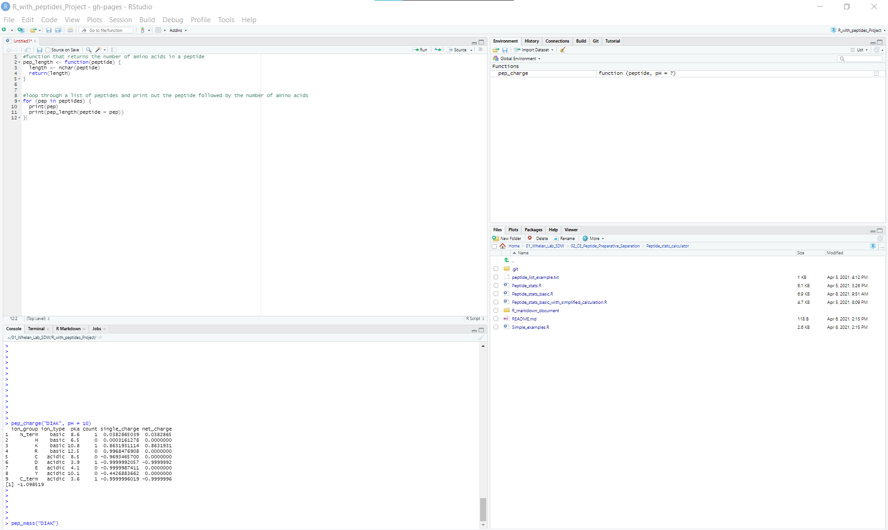
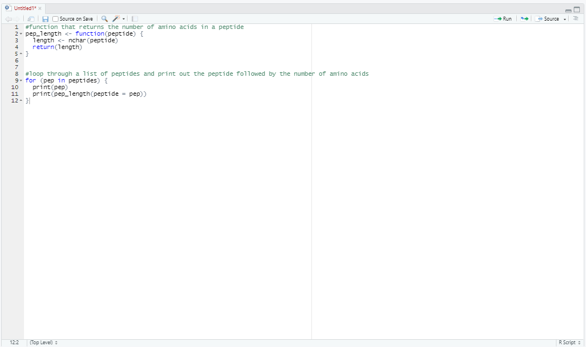
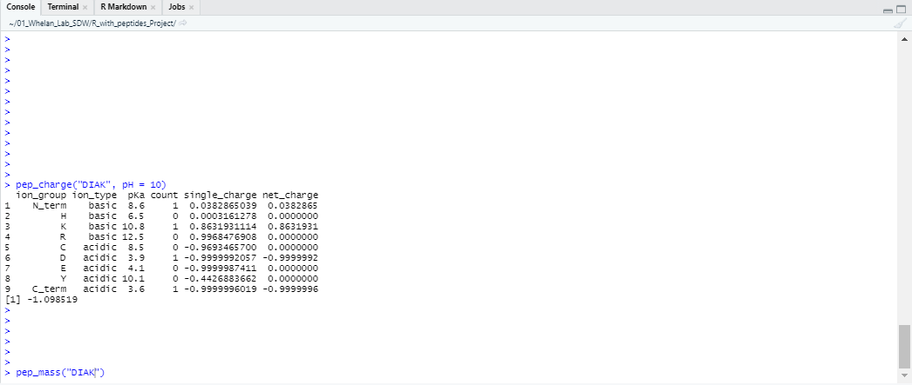
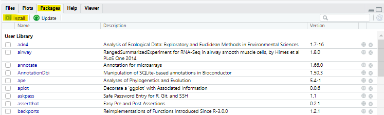
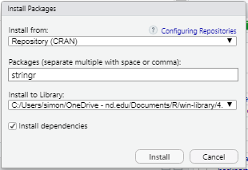

## Accessing R

### RStudio
RStudio is the best way to use R. It is free to download [here](https://www.rstudio.com/products/rstudio/download/). Simply select 'free' on this webpage, and download the appropriate version for your computer.  

### RStudio Cloud
If you don't want to download RStudio to your computer, you can use a limited online version by making an account on [RStudio Cloud](https://rstudio.cloud/). The free version of RStudio Cloud only allows for 15 hours of time per month, but that will be plenty of time to complete this project  

## Navigating RStudio
When opening up RStudio, the first thing to do is to open a '.R' file. This is just a text file that is formatted for working with R. To do this, go to:  
```
File > New File > R script
```
At this point there should be four windows open, and it will look something like this:  
  

The top right window is the 'environment' which is where your variables will show up. You don't have to worry too much about this. The bottom right window is a file explorer. This can be very useful, but you won't use it in this project much. The top left is the text editor. This is where you can copy and paste blocks of code that you want to use and maybe edit later. Here is a zoomed in screenshot of this window: 

To run code here, highlight what you want to run and then click the 'Run' button in the top right corner of the window. Alternatively, you can run by pressing ctrl+enter.  

The bottom left is the console, which is where all the R code is executed, and any outputs are printed. If you run code from the editor (as described above), it will be executed here. Alternatively, you can run single lines of code here by just typing them out. Here is a a zoomed in screenshot of the console:  
  

You'll see that I have run a function: `pep_charge("DIAK", pH = 10)` and got a printout with the result. I've typed, but not yet run, a function called `pep_mass()`. You run code from the console by simply pressing enter.  

## Installing packages
For this project, you will need to have the package `stringr` installed in your environment. There are several ways to do this (try googling 'install package R') but the easiest thing to do is to click on the 'packages' tab in the bottom right window. From there, click on 'Install', and type 'stringr' into the packages box. Press 'Install' and RStudio will import your package for you (it may take ~10 seconds). See the screenshots below for help with this process:  

 

 

## Definitions
While the goal of this project is to get the student using R without going through an intense training process, it still is helpful to know several key definitions. [Tutorialspoint.com](https://www.tutorialspoint.com/r/index.htm) breaks down R to the basics, and I reccomend you read just a little bit about R here before you start (Not more than 10 or 15 minutes). For the purpose of this project, focus on the tabs called 'Variables', 'Decision Making', 'Loops', and 'Functions'.

## Helpful links
There are many online resources for R and Rstudio. Here are a couple of good links if you are stuck or want to learn more:  

* [Intro to R and RStudio](http://www.sthda.com/english/wiki/r-basics-quick-and-easy)
* [Installing R and installing and using packages](https://youtu.be/jWEI-KKrT0Y)
* [r-bloggers](https://www.r-bloggers.com/)


