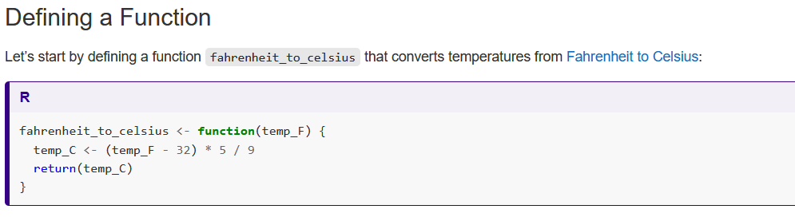
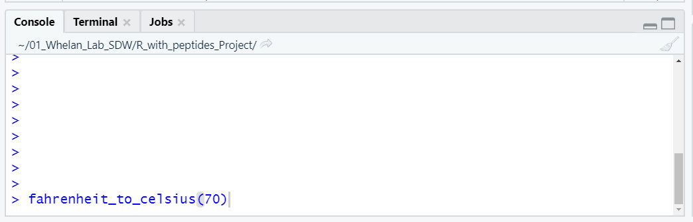
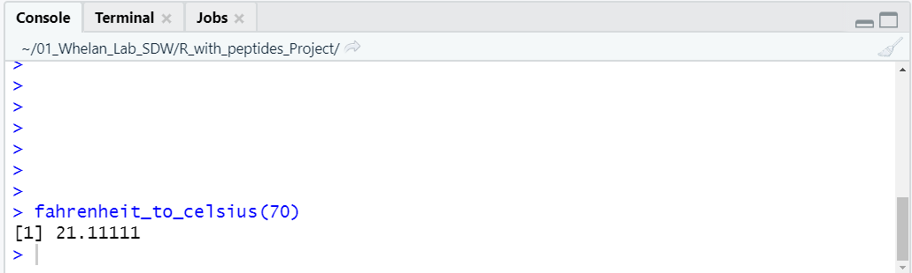
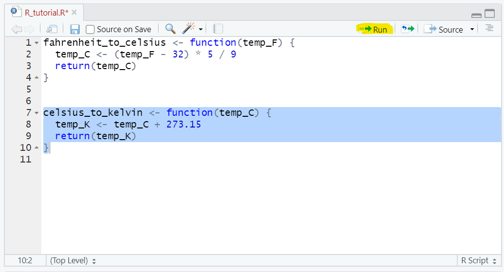
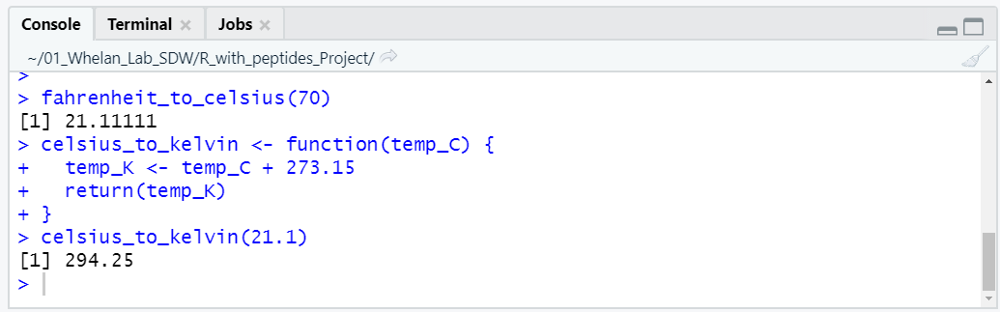

## Setting up your workspace
For this assignment, you will be copying and pasting blocks of code from this website into RStudio. From RStudio, you will be able to execute the code, see your results, and make minor modifications to the code.  

As mentioned in the resources tab, the first thing to do is to open an '.R' file. If you haven't done this already, go ahead and follow these instructions:
 
```
File > New File > R script
```
At this point there should be four windows open in RStudio, and it will look something like this:  
  

You can go ahead and save your '.R' document by going to `File > Save As` and choosing an appropriate location and name for the file (perhaps 'Peptides_in_R_assignment.R'). This saves your R file (which is the top left window in the screenshot above) and means that you can re-open it anytime you want by going to `File > Open File`.  

## Copying and Pasting Code
We're going to use an awesome tutorial from Software Carpentry as an example for how to copy and paste code into RStudio. Feel free to follow along on your own computer if you want. [Here is a link to the tutorial](https://swcarpentry.github.io/r-novice-inflammation/02-func-R/index.html).  

This page has a couple of functions that I'm interested in using, namely `fahrenheit_to_celsius` and `celsius_to_kelvin`. As you can guess, these functions do temperature conversions.  

Here is a screenshot from Software Carpentry that shows where they wrote the function `fahrenheit_to_celsius`.
  
I'm going to copy and paste this entire block of code into my '.R' file. Don't worry about understanding what is happening with the code yet; at this point we only want to get it into RStudio. Here is what that looks like:  


To be able to use the function, I have to 'run it'. I will highlight all the lines of code, and then press 'run' as highlighted in the screenshot below. 
  

Once that happens, it will show up in my environment tab in the top right window. Now to use the function, I can run it in the console (bottom left window). The easiest way to do this is to type the function into the console along with an argument (which in this case will be the temperature I want to convert: 70), and then press enter. The argument goes inside the parentheses right after the function. Here is a screenshot of that:  


When I press enter, it takes the input value I provided (70) and uses the function `fahrenheight_to_celsius` to do the calculation. Here is what the output looks like:



It looks like 70F is 21.1C. 

Also on the Software Carpentry website is a function to convert celsius to Kelvin. I'm going to copy and paste that function into my '.R' file as well:


Notice that I put this new block of code a few lines under the previous one to keep them separated. Now I will highlight this block of code and run it to make the new `celsius_to_kelvin` function availible:



Now I can execute this function in the console as well. Lets convert 21.1C to Kelvin. Remember, type the function and the argument and press enter:



If you want to save your progress, you can save the '.R' file where you've been copying code by going to `File > Save`.  

Those are the basics of copying code into RStudio and executing it! The important things to remember are: 

* Copy code into the top left window (Your '.R' file).
* Highlight the code and press 'Run' to make the functions available.
* Use the functions by typing them in the console in the bottom left window.
* You can put multiple functions or blocks of code in the same R file. Just make sure to separate them with a couple of blank lines.

In addition to functions, you can copy other blocks of code (like `for` loops) into your R file, and run them the same way: by highlighting and pressing run. We'll get into that later in the tutorial.

## Modifying Code
The next step after getting the code into RStudio is to make modifications to suit your needs. Let's say that I want to add in a line of code that tells me the units of my output. I can edit the functions directly in the '.R' file like in the screenshot below: 


In this case, I've added the two highlighted lines, which tell the functions to print out the units of the temperatures when they are calculated. Because I've changed the '.R' file, I need to 'run' the functions again. To do this, highlight them and press run: 


Now when I run either of the functions in the console, it will also print out the temperature scale used:  


Those are the basics of editing code! The important aspects are:  

* Make your modifications in the '.R' file.
* Re-run the '.R' code by highlighting the modified code chunks and pressing run.
* Use your modified functions by typing them into the console and pressing enter.

## Applications to this assignment
Those are the basic steps that you will need to complete this assignment: Copying blocks of code from this website, running them in your '.R' file, using them in the console, and making modifications in the '.R' file. 

Step 1 has you copying and pasting a function that calculates the charge of a peptide. Step 2 has you using this function in the console to apply it to a real world problem. Steps 3 and 4 have you making modifications to blocks of code in order to apply them to your own data.


