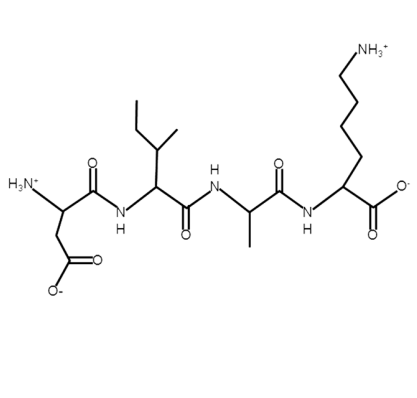

## Calculating the charge of a peptide
Net eptide charge can be represented as the sum of the charge on each individual amino acid in the peptide sequence. Of the 20 common amino acids, seven can be ionized under normal conditions to produce charged species. Three of these seven (lysine, arginine, histidine) are considered basic. They gain a proton to become positively charged when the pH is below their pKa. Four are considered acidic cCysteine, tyrosine, glutamic acid, aspartic Acid), and these lose a proton to become negatively charged when the pH is above their pKa. In addition to the residues themselves, the N-terminus of the peptide is basic, and can become positively charged, and the C-terminus is acidic, and can become negatively charged. All together, that is 9 ionizable groups that must be considered when calculating the net charge of the peptide. (Other groups can occasionally be ionized and contribute to the charge, but they are outside the scope of this project.)

However, just because the pH is above or below an ionizable group's pKa doesn't mean that all of the residues will be protanated/unprotanated. The fraction of a species that is protanated is a term in the Henderson-Hasselbalch equation ($pH = pK_a + log_{10}(\frac{[base]}{[acid]})$), which can be rearranged to show the ratio of [base]/[acid] or [acid]/[base] as a function of pKa and pH.
\begin{equation}
\tag{1}
\frac{[base]}{[acid]} = 10^{(pH-pK_a)}
\end{equation}
\begin{equation}
\tag{2}
\frac{[acid]}{[base]} = 10^{(pK_a-pH)}
\end{equation}
For 'basic' residues (and the N-terminus), the charged (+) state is when they are protanated, or in their 'acid' form. For this, the fraction that are protanated can be given by:
\begin{equation}
\tag{3}
f=\frac{[acid]}{[acid] + [base]}
\end{equation}
This can be rearranged and substituted with equation 2, to give the fraction of the residue that is charged (and therefore the average or measurable charge (z) of a population) as a function of pH and pKa:
\begin{equation}
\tag{4}
z_{basic}=\frac{10^{(pK_a-pH)}}{10^{(pK_a-pH)} + 1}
\end{equation}
For acidic residues (and the C-terminus), the same derivation can be performed using equation 1 to obtain the charge (z) as a function of pH and pKa. (Note that it is (-) because the charged state is the lack of a proton, and therefore a negative charge)
\begin{equation}
\tag{5}
z_{acidic}=-(\frac{10^{(pH-pK_a)}}{10^{(pH-pK_a)} + 1})
\end{equation}
From these equations, we can calculate the charge on any one residue (or terminus) if we know three things:  

* The species' pKa
* Whether it is acidic or basic
* The pH.  

Then by counting the number of each ionizable group in a peptide, we can add up their respective charges to arrive at a net charge for the peptide at any given pH. (For a more complete derivation of these equations, see [this](https://pubs.acs.org/doi/abs/10.1021/ed100232j) article)  

## Code
The function below: `pep_charge()`, takes two arguments: `peptide` which is a variable that corresponds to a peptide written out in one letter code, and `pH` which is a number between 0 and 14 designating the pH of interest. You can copy and paste this entire block of code into the '.R' file in your code editor, highlight it, and click run to have the function available to you. (You will need to add the `stringr` package if you don't already have it installed. See the step by step instructions in the 'Resources' tab or [this link](http://derekogle.com/IFAR/supplements/installations/InstallPackagesRStudio.html) for installing R packages.)

```{r, warning=FALSE}
#load required packages
library('stringr')


#Calculate Charge of a peptide at a specific pH
pep_charge <- function(peptide, pH = 7) {
  
  #convert any lowercase to uppercase
  peptide <- toupper(peptide)
  
  #create charge dataframe. This has a row for each ionizable group ('ion group'),
  #with its corresponding type of ion (basic or acidic - 'ion type'),
  #and an approximated pKa ('pKa'). These pKa values can be updated for different situations
  ion_group <- c('N_term', 'H', 'K', 'R', 'C', 'D', 'E', 'Y', 'C_term')
  ion_type <- c('basic', 'basic', 'basic', 'basic', 'acidic', 'acidic', 'acidic', 'acidic', 'acidic')
  #EMBOSS pKas
  pKa <- c(8.6, 6.5, 10.8, 12.5, 8.5, 3.9, 4.1, 10.1, 3.6)
  net_charge_df <- data.frame(ion_group, ion_type, pKa)
  
  #add a column for counting the number of each potentially charged residue, set at 0 to start
  net_charge_df$count <- 0
  #for each residue of interest, count the number of occurances in the peptide
  for (i in 1:nrow(net_charge_df)) {
    net_charge_df$count[i] <- str_count(peptide, net_charge_df$ion_group[i])
  }
  #set the number of occurences of the n-termini and c-termini to one each
  net_charge_df$count[net_charge_df$ion_group == 'N_term'] <- 1
  net_charge_df$count[net_charge_df$ion_group == 'C_term'] <- 1
  
  #create a column that stores the charge of a single instance of each ionizable group at the given pH.
  #set it to zero to start
  net_charge_df$single_charge <- 0
  
  #check if each ionizable group is acidic or basic.
  #calculate the charge for a single instance of each group. For the acidic groups, this charge will be negative (lost a proton)
  #these are calculated by determining the fraction of the group that is protanated vs. not protanated using the supplied pH and pKa values
  for (i in 1:nrow(net_charge_df)){
    if (net_charge_df$ion_type[i] == 'basic') {
      net_charge_df$single_charge[i] <- (10^(net_charge_df$pKa[i] - pH))/((10^(net_charge_df$pKa[i] - pH)) + 1)
    }
    if (net_charge_df$ion_type[i] == 'acidic') {
      net_charge_df$single_charge[i] <- -(10^(pH - net_charge_df$pKa[i]))/((10^(pH - net_charge_df$pKa[i])) + 1)
    }
  }
  
  #create a new column that is the net charge for each ionizable group (simply the charge of one instance * number of instances)
  net_charge_df$net_charge <- net_charge_df$count * net_charge_df$single_charge
  
  #sum all of the indivdual net charges to produce a total net charge of the peptide.
  total_net_charge <- sum(net_charge_df$net_charge)
  
  #print the dataframe. This can be commented in or out depending on whether this information is wanted
  print(net_charge_df)

  #return the net charge value
  return(total_net_charge)
}

```

*Quick Description of the code:*

*First we convert the peptide variable to all uppercase letters. Then we create a dataframe (type of table or matrix with columns and rows) that contains all the ionizable groups in one column, their corresponding basic or acidic designation in the next, and their pKa value in the third column. We add a column that counts the number of instances of each group in the pepdide, and assign that value to the count column. Next we make a column that keeps track of the charge for one instance of each group. The 'if' statements nested within the 'for loop' do the hard work of actually calculating the charge for each residue. They check whether the group is basic or acidic, and then apply the correct equation. From there, we just multiply the charge by the number of instances of that group, and then add up all the charges. We can print the dataframe to see exactly how we got to the final number, and we return the total net charge*

It is important to note that there are multiple options for the set of pKa values. The ones in the code above come from the [EMBOSS](https://www.ebi.ac.uk/Tools/emboss/) tools, but you could easily replace these with several other sets. One activity could be updating these pKa values with those from another source, and seeing how much the final peptide charge changes. It is also important to acknowledge that local environment can influence the pKa of any ionizable group.

## Exercise (1)
The exercise for step one is simple. Simply run the function with an example peptide: <font color="blue">DIAK</font>. 
{width=40%}   

This peptide has 4 ionizalbe groups: Aspartic acid, Lysine, the N-terminus, and the C-terminus. We will evaluate the charge of this peptide at 2 different pH values: 7.0 and 3.0. 

After ensuring that you have loaded the `pep_charge()` function, try it out in the console. We will set `peptide = "DIAK"` and `pH = 7.0` first. Type or copy and paste the code below into your console and press enter.
```{r}
pep_charge(peptide = "DIAK", pH = 7.0)
```
The first printout is the dataframe that we used to create each charge. Can you tell what each column is for? Read through the `pep_charge()` code above, and compare it to this dataframe to determine how each value is calculated.

The second printout is the net charge that we calculated. It is negative, but very close to 0, indicating that this peptide is close to neutral at pH 7.0 even though there are 4 charged groups. This is because the positive charges of the N-terminus and the Lysine cancel out the negative charges of the Aspartate and the C-terminus. Lets try the same thing at pH 3.0.
```{r}
pep_charge(peptide = "DIAK", pH = 3.0)
```
At this lower pH, the charge of the peptide is more than 1.5 and less than 2. Why is this? Both of the basic residues are essentially fully charged at this pH (see the `net_charge` column), but only about 10% and 20% of the Asp and C-term are negatively charged. When these charges are added up, we get a value of +1.7 for the net charge of the peptide.

<font color="purple">Take screenshots of your console showing the dataframe and net charge for DIAK at pH 7 and pH 3, and paste this into your assignment. Predict the charge of "DIAK" at pH 12, and feel free to run `pep_charge()` at that pH to check your answer.</font>