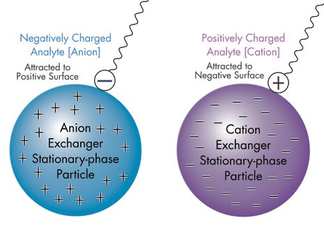

## Applying the charge calculation to Anion Excahnge Chromatography (AEX)
For step 2, we will apply this peptide charge function to new data in order to predict the elution of a mixture of peptides from a anion exchange column. In AEX, the stationary phase of the column is positively charged, which retains negatively charged species. By changing the pH of the mobile phase, analytes can be eluted off the column depending on their charge at the different pH values.  

{width=50%}  

## Exercise (2)
Assume you have a mixture of these 5 peptides:  

DIAK  
RAAVSK  
EGNTQR  
EPLSHR  
ASCHK  

And that that they are in a buffer at pH 10. You add them to an anion exchange column in the pH 10 buffer. You collect the flow through (eluate) from the pH 10 buffer and label it 'Fraction 1'. Next, you change the mobile phase to a buffer at pH 7, and rinse the column several times with this buffer. You collect this eluate, and label it 'Fraction 2'. Finally, you repeat the process with a buffer at pH 3. The eluate at pH 3 is labelled 'Fraction 3'.  

Based on the charges of each peptide at each pH, which peptides eluted in which fraction?  (For the purpose of this exercise, assume that if a peptide is (+) charged it elutes, and if it is (-) charged it retains, no matter how close to neutral it is.)  

Did any peptides retain on the column at pH 3? Why or why not?