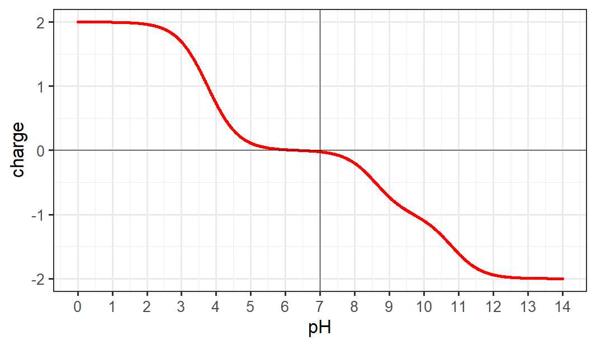

## Further applications - Peptide summary function, pH vs charge plot, Isoelectric point calculator
For steps 1-3, hopefully most students were able to follow along and complete the objectives. The point of this project is to show that even without an extensive knowledge of coding, it is possible to take published scripts and functions and use them for your own data, even making simple modifications. Step 4 involves writing your own code from scratch, which I acknowledge takes more experience and more extensive background knowledge with a programming language. However, there are many excellent free resources online for diving into this sort of challenge. The best way to start out coding from scratch is to identify a question and work at it until a solution presents itself. In this section I will present several 'questions' that relate to the problems discussed in steps 1-3. There are many ways to successfully complete these challenges, but I will post possible solutions for each one [here](https://github.com/weaversd/R_with_peptides_Project/tree/gh-pages/R_scripts) on git-hub. They are roughly in order of difficulty from easiest to hardest.

## Exercise (4a)
We now have functions that calculate the charge of a peptide, the mass of a peptide, the m/z at a given pH of a peptide, and the expected m/z of a peptide in a MALDI spectrum. It would be helpful if we had a function that could summarize all of them. The goal for this function is to take a peptide and a pH, and print out all of the attributes we can calculate. Here is a framework with which to write your function.
```{r}
peptide_summary <- function(peptide, pH){
  
  #Your code goes here
  
}
```

## Exercise (4b)
We have a function that can calculate the charge of a peptide at any given pH. Can we use this to create a plot of the charge of a peptide over a large range of pH? This is useful for quickly estimating the isolectric point of a peptide, or prediciting its behaivior in different buffers or separation methods. The goal of this exercise is to create a plot like this, which is for the peptide DIAK:

This takes some knowledge of how to create plots in R. The easiest way is to simply call two vectors or lists which are x and y coordinates to the function `plot()` like this `plot(pH_list, charge_list)`. If you are interested in data visualization, there is a very powerful package called ggplot2 that is relatively easy to understand and can create beautiful graphs and charts.

Try doing this from scratch. Some pseudocode is below to help you get started if you are stuck

```
Pseudo code:

pH is a list of 1000 pH values from 0 to 14
charge is a list of 1000 values

for each value in list pH,
  caluclate the charge for peptide "DIAK" and store it in the list charge
  
plot pH and charge
```
```
Helpful functions:
seq(x, y, z) creates a vector of numbers that goes from x to y, incrementing by z
rep(a, b) creates a vector of length b, and each value is a
length(x) returns the length of a vector or list x
```

## Exercise (4c)
Isoelectric point is the point that a protein or peptide has a net charge of 0. We can estimate this based on the graph we created in Exercise 4b (for DIAK it is approximately 6.3) but it would be helpful if we were able to create a function that calculated this for us. Here is a framework for the function:
```{r}
pep_pI <- function(peptide){
  
  #your code goes here
  
}
```

[A paper from Dr. Kozlowski](https://biologydirect.biomedcentral.com/articles/10.1186/s13062-016-0159-9) nicely presents a methodology to do this. The general idea is to start at an 'average' pH (lets use 7) and see what the charge is. Depending on whether it is positive or negative, try a new pH that is lower or higher, and repeat this process until you reach zero charge. There are several things to consider.:

* How far do we move from the previous pH value to the new one?
* Do we do this an arbitrary number of times? OR
* Do we do this until the charge is *close* enough to zero?  

An easy answer to the first question is to simply divide the search area in half each time. For example, suppose we try pH 7 and get a negative charge value. We know the pI will be lower than pH 7, so we divide the pH range 0-7 in half and try again at 3.5. This time, the charge is positive, so we know that the pI is higher than 3.5, but lower than 7. Now we divide this range in half and try again at 5.25. We continue this process either for a certain number of iterations, or until the charge is close enough to zero. Good luck!
